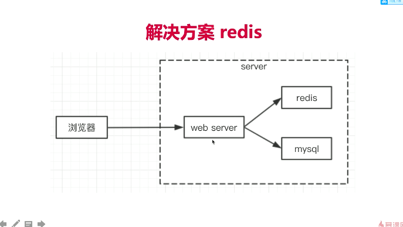

# 登录
## 1. cookie
1. 存储在浏览器的一段字符串 5kb
2. 跨域不共享
3. 格式```key1=val1;key2=val2;...```
4. 每次发送http请求，会将请求域的cookie一起发送给server
5. server可以修改cookie并返回给浏览器
6. 浏览器可以通过js修改cookie(有限制)

## 2. cookie
1. 后端写入cookie: ```res.setHeader('Set-Cookie', 'username=ADMIN; path=/';)```
2. 限制前端修改cookie: ```res.setHeader('Set-Cookie', 'username=ADMIN; path=/'; httpOnly)```
3. cookie设置过期时间: 
```
    // 获取cookie过期时间
    const getCookieExpires = () => {
        const date = new Date()
        date.setTime(date.getTime() + (24 * 60 * 60 * 1000))
        console.log(date)
        return date.toGMTString()
    }
    res.setHeader('Set-Cookie',
        `username=${username}; path=/ httponly; expires=${getCookieExpires()}`)
```

### cookie 优缺点
优点：
1. 可配置到期时间
2. 不需要任何服务器资源，cookie存储在客户端并在发送后由服务端读取
3. 简单，基于文本包含简单的键值对
4. 

缺点：
1. 存储数量和长度限制（20条， 每条不超过4kb）；
2. 有些数据不宜保存在客户端cookie中
3. 可能会被篡改
4. 安全，只适合存放不敏感信息

## 3. session
为什么要使用session
优点：
1. 保存在服务端
2. 大小可控制
3. 用户端存储用户信息（客户端保存userId）

### node服务将session存储在内存中的问题
会有内存被占用，导致node服务奔溃

## 4. redis
1. web server最常用的缓存数据库，数据存放在内存中

#### 数据存放在内存的问题及好处
好处：
1. 读写书读快
2. 相比mysql,访问速度快
3. 

问题：
1. 内存昂贵
2. 断电会丢失数据
3. 空间小

- 将web server和redis拆分成两个单独额服务
- 双方独立，都可以扩展（例如扩展成集群）
(mysql 也是单独的服务，可扩展)

### 使用redis优化session存储问题

1. 如上图，redis是单独的服务，如果将session存储在redis中，即使redis内存泄露，也不会导致node server进程奔溃。
2. 将session数据存储在redis中，多个node server可以共享redis中的数据
3. redis可以扩展，不需要担心内存被用完

### 为什么session放在redis中，而不是放在mysql中
1. 服务使用session性能要求高，频繁；因此需要放在内存中，提高读写速度

### redis 命令
```
    redis-server
    redis-cli
    set name roby
    get name
    get *
    del name
```